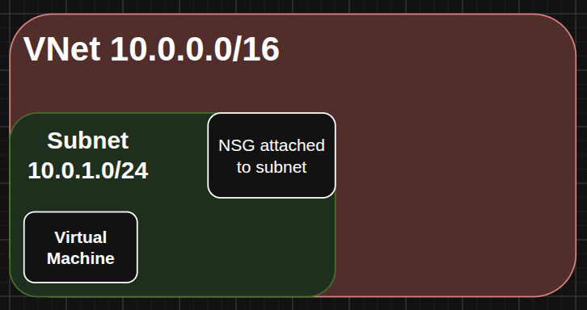
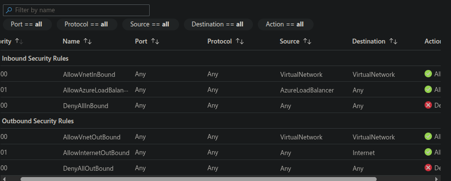
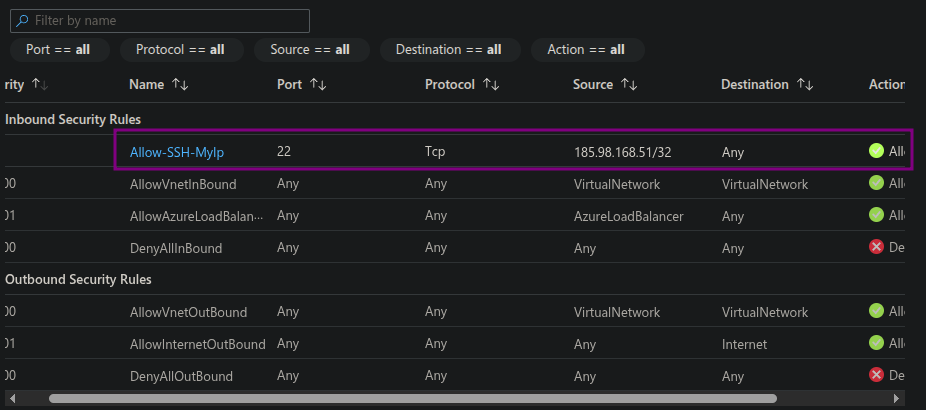

# Secure Single VM in an Isolated Azure VNet

A hands-on lab demonstrating least-privilege network access design in Azure — deploying an isolated VM secured by a default-deny Network Security Group (NSG), with inbound SSH scoped to a single known source IP.

Built as part of my Azure Cloud Security Engineer portfolio track while studying for AZ-900.

---

## Architecture



- **VNet**: `vnet-lab` (`10.0.0.0/16`)
- **Subnet**: `subnet-lab` (`10.0.1.0/24`)
- **VM**: `vm-lab` — Ubuntu 22.04, Standard_D2s_v7
- **NSG**: `nsg-lab`, attached at the subnet level

---

## Problem → Fix → Evidence

### 1. Least-privilege SSH access by default
**Problem:** A standalone NSG (created independently rather than auto-generated alongside a VM) ships with only the Azure platform defaults — `AllowVnetInBound`, `AllowAzureLoadBalancerInBound`, and `DenyAllInBound`. No SSH access exists out of the box, including from my own workstation.

**Fix:** Added a single scoped inbound rule permitting TCP/22 from my public IP only (`/32`), rather than opening SSH broadly and narrowing it later.

```bash
MY_IP=$(curl -s ifconfig.me)

az network nsg rule create \
  --resource-group rg-compute-net-lab \
  --nsg-name nsg-lab \
  --name Allow-SSH-MyIP \
  --priority 100 \
  --source-address-prefixes "${MY_IP}/32" \
  --destination-port-ranges 22 \
  --access Allow \
  --protocol Tcp \
  --direction Inbound
```

**Evidence:**





### 2. Subscription quota restriction on B-series VMs
**Problem:** `Standard_B1s` deployment failed with `SkuNotAvailable`. Initial assumption was regional capacity — but `az vm list-skus` showed the entire A/B-series family absent from the region's SKU list entirely, not just flagged as restricted.

**Fix:** Confirmed via `az vm list-usage` that the subscription had a 0/0 quota limit on the B-series family (common on new free-tier subscriptions as a fraud-prevention default). Pivoted to `Standard_D2s_v7` to stay unblocked while a quota increase request is pending.

**Evidence:**

```
ldgrady@LDGV-DESKTOP:~/repos/azure-projects/nsg-lab$ az vm list-usage --location eastus --query "[?localName=='Standard BS Family vCPUs']" --output table


```

### 3. Silent bash line-continuation bug
**Problem:** A trailing space after a `\` line-continuation character in a deployment script caused bash to silently terminate the command early, producing a confusing `unrecognized arguments` error several lines removed from the actual bug.

**Fix:** Removed trailing whitespace after all `\` continuations and added `set -euo pipefail` to the script so future failures surface immediately instead of cascading.

---

## Why this matters

Overly permissive SSH exposure remains one of the most common initial-access vectors documented in cloud breach reports. Scoping inbound rules to a single known source — rather than defaulting to broad access and tightening later — is a small design choice with outsized security impact.

---

## Tech used

`Azure CLI` · `Azure Virtual Network` · `Network Security Groups` · `Ubuntu 22.04` · `Bash`

---

## How to reproduce

```bash
git clone https://github.com/Debonair-Cyber/azure-nsg-lab
cd azure-nsg-lab

# 1. Create resource group, VNet, subnet, and NSG
./scripts/setup-network.sh

# 2. Deploy the VM
./scripts/create-vm.sh

# 3. Add the scoped SSH rule (replace with your own IP)
./scripts/allow-ssh.sh

# 4. Tear down when done
az group delete --name rg-compute-net-lab --yes --no-wait
```

**Prerequisites:** Azure CLI installed and authenticated (`az login`), an active Azure subscription.

---

## Lessons learned

- A standalone NSG has *no* implicit SSH allowance — a good forcing function for designing access intentionally rather than retrofitting an over-permissive default.
- `SkuNotAvailable` errors can mean two very different things (regional capacity vs. subscription quota) — `az vm list-usage` is the fastest way to tell them apart.
- Free-tier/trial subscriptions may start with 0 quota on "free-tier eligible" VM families, requiring a manual quota increase before those SKUs are usable at all.

---

## What's next

This VNet/NSG foundation feeds directly into my next project: a full **Secure Landing Zone** build layering Conditional Access and Privileged Identity Management (PIM) on top of this network baseline.

[Link to next project once published]
